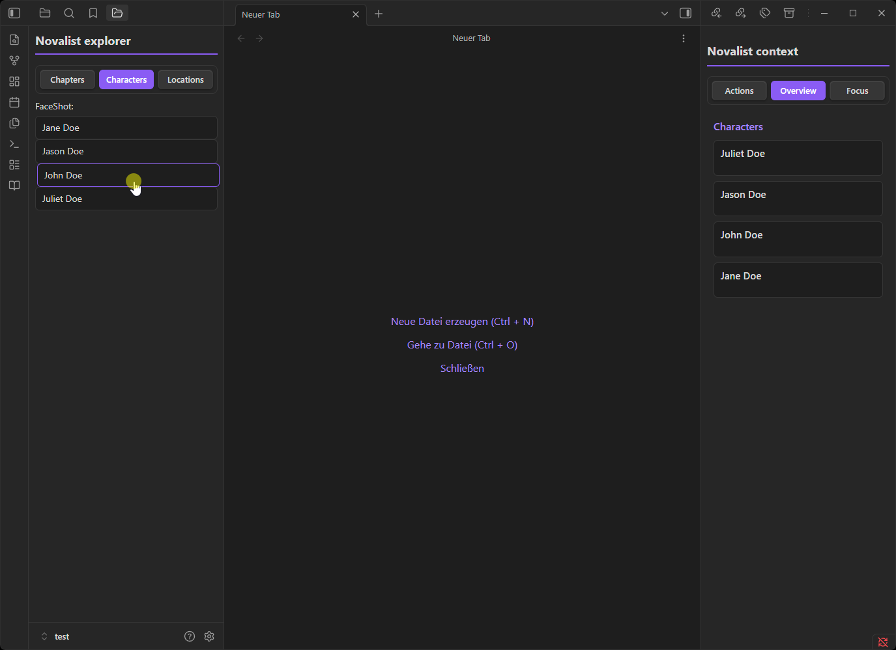
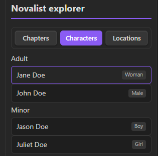
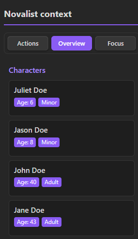
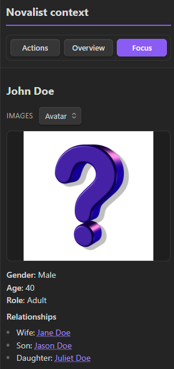
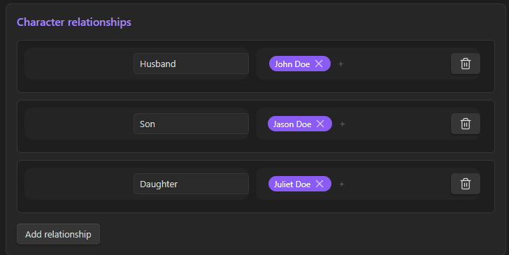

# Novalist for Obsidian

Turn Obsidian into a dedicated novel-writing environment. **Novalist** helps you organize characters, manage locations, and keep track of your plot without leaving your text editor.

## Key Features

### World Building Made Easy
*   **Character Management**: Create detailed character sheets with roles, relationships, and images.
*   **Location Tracking**: Define the places in your world and keep them organized.
*   **Interactive Sidebar**: See exactly which characters and locations are mentioned in your current chapter at a glance.

### Distraction-Free Writing
*   **Smart Dialogue Formatting**: Automatically format your quotes as you type. Supports English (`“...”`), German (`»...«`, `„...“`), French (`«...»`), and more.
*   **Intelligent Linking**: Hover over character names in your text to see a quick preview of their details.
*   **Auto-Complete**: Quickly reference characters and relationships while writing.

### Project Organization
*   **Dedicated Explorer**: A custom view to manage your Chapters, Characters, and Locations separately from your other Obsidian notes.
*   **Drag-and-Drop Reordering**: Easily rearrange your chapters to structure your story.
*   **Project Structure**: Automatically sets up a organized folder structure for your novel.

## Getting Started

1.  **Install & Enable** the plugin.
2.  The **Startup Wizard** will automatically launch to guide you through:
    *   Setting up your project folder.
    *   Choosing your dialogue style.
    *   Initializing the folder structure.
3.  Take the **Guided Tour** to learn the interface.
4.  Start writing!

### Quick Demo

## Features in Detail

### Novalist Explorer

A dedicated project explorer with three tabs — **Chapters**, **Characters**, and **Locations** — so you never have to dig through your vault's file tree.

*   **Chapters** are sorted by their frontmatter `order` field and displayed as a numbered list. **Drag and drop** chapters to reorder them; all `order` values update automatically.
*   **Characters** are grouped by role (Main, Side, Background, and any custom roles). **Multi-select** with `Ctrl+Click` or `Shift+Click`, then drag a selection onto another role group to bulk-reassign roles.
*   **Locations** are listed alphabetically. Clicking any item opens its dedicated sheet view.
*   Right-click any entry for a context menu with quick **Delete**.

### Character Sheet

Every character file opens as a structured, form-based editor instead of raw Markdown.

*   **Basic info** — Name, Surname, Gender, Age, and Role are all editable in place. Renaming a character automatically renames the underlying file.
*   **Images** — Browse your project's image folder, or **drag and drop** images directly onto the sheet. Duplicate images are detected via SHA-256 hashing.
*   **Relationships** — Add relationship rows with a role label (e.g. *mother*, *rival*) and tag other characters with inline autocomplete. When you link Character A to B, an **Inverse Relationship** prompt asks for the reverse role so both files stay in sync.
*   **Chapter overrides** — Select a chapter from the dropdown to record chapter-specific changes (age, appearance, images) without touching the character's base data.
*   **Custom properties & free-form sections** — Add any extra key-value pairs or rich-text sections (Appearance, Personality, etc.) with suggested headings pulled from your other characters.

### Context Sidebar & Focus Mode

A right-hand sidebar with three tabs: **Actions**, **Overview**, and **Focus**.

*   **Overview** scans the active chapter and lists every mentioned character and location with their age, role, and relationships — perfect for keeping track of who is in a scene.
*   **Focus** shows a full read-only preview of a single entity. Move your cursor over a name in the editor and the sidebar updates automatically.
*   Character images respect chapter overrides — if the current chapter has a specific image for a character, that image is shown instead of the default.
*   Clicking a `[[WikiLink]]` inside the focus panel navigates directly to that entity's preview.

### Relationships

Define how your characters are connected directly inside the Character Sheet.

*   Each relationship row has a **role label** (e.g. *mother*, *rival*, *mentor*) and one or more **character tags** added via inline autocomplete.
*   When you link Character A to B, an **Inverse Relationship** prompt automatically asks for the reverse role (e.g. A is B's *mother* → B is A's *daughter*), keeping both files in sync.
*   Remove a tag with the **×** button on its badge, or delete the entire row with the trash icon.

## Useful Commands

Access these via the Command Palette (`Ctrl/Cmd + P`):

*   `Novalist: Create new character`
*   `Novalist: Create new location`
*   `Novalist: Open context sidebar`
*   `Novalist: Initialize novel project structure` (if you need to reset folders)

---

## Support Development

If you find Novalist helpful in your writing journey, consider supporting its development. It helps me dedicate more time to adding features and improvements!

*Write your story, better.*
