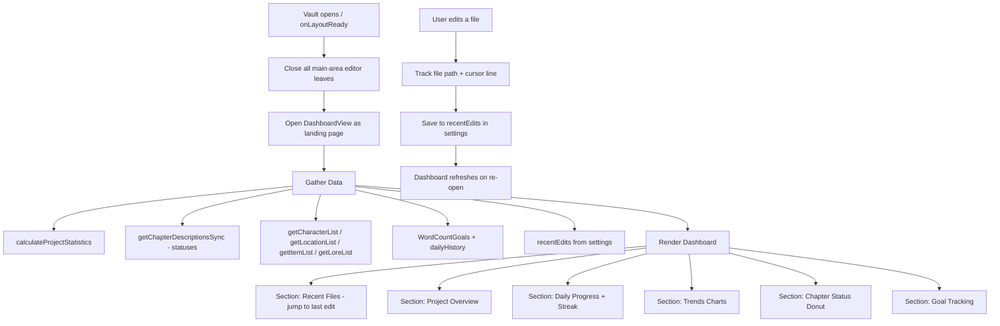

# Dashboard Feature — Architecture Plan

## Overview

A new **Dashboard** view that serves as the **landing page** when opening the vault. It shows comprehensive project completion metrics, daily progress tracking, trend visualizations, goal management, and a **recent files** section for quickly jumping back to the last edited position. On vault startup, the Dashboard automatically opens and closes any previously open editor tabs.

---

## Architecture Diagram



---

## Files to Create / Modify

### New Files

| File | Purpose |
|------|---------|
| [`src/views/DashboardView.ts`](src/views/DashboardView.ts) | Main Dashboard view class extending `ItemView` |

### Modified Files

| File | Changes |
|------|---------|
| [`src/main.ts`](src/main.ts) | Import + `registerView` + `activateDashboardView()` + command + auto-open on startup + recent-edit tracking |
| [`src/utils/toolbarUtils.ts`](src/utils/toolbarUtils.ts) | Add Dashboard button to Views panel |
| [`src/types/index.ts`](src/types/index.ts) | Add `RecentEditEntry` interface, extend `WordCountGoals` history limit |
| [`src/utils/statisticsUtils.ts`](src/utils/statisticsUtils.ts) | Add streak calculation, expand daily history retention to 365 days |
| [`src/i18n/en.ts`](src/i18n/en.ts) | Add ~35 dashboard-related i18n keys |
| [`src/i18n/de.ts`](src/i18n/de.ts) | Add corresponding German translations |
| [`src/settings/NovalistSettings.ts`](src/settings/NovalistSettings.ts) | Add `recentEdits` default to `DEFAULT_SETTINGS` |
| [`styles.css`](styles.css) | Add `.novalist-dashboard-*` CSS rules |

---

## New Feature: Auto-Open on Vault Startup

When the vault opens, the Dashboard should be the first thing the user sees.

**Implementation in [`main.ts`](src/main.ts) `onLayoutReady`:**

```typescript
this.app.workspace.onLayoutReady(async () => {
  // Close all main-area leaves (editor tabs from previous session)
  this.app.workspace.iterateAllLeaves(leaf => {
    if (leaf.getRoot() === this.app.workspace.rootSplit) {
      leaf.detach();
    }
  });
  // Open dashboard as landing view
  await this.activateDashboardView();
});
```

This ensures:
- All previously open markdown/editor tabs are closed
- Sidebar views (explorer, sidebar panel) remain untouched
- Dashboard opens in the main content area as the landing page

---

## New Feature: Recent Files Tracking

Track the last N edited files (with cursor line) so the user can jump straight back to where they left off.

### Type Definition

Add to [`src/types/index.ts`](src/types/index.ts):

```typescript
export interface RecentEditEntry {
  /** File path relative to vault root */
  filePath: string;
  /** Display name (chapter title or filename) */
  displayName: string;
  /** Last known cursor line (0-based, matching Obsidian EditorPosition) */
  line: number;
  /** Last known cursor column/character (0-based) */
  ch: number;
  /** Timestamp of last edit (ISO string) */
  timestamp: string;
}
```

### Settings Storage

Add to [`NovalistSettings`](src/types/index.ts:19):

```typescript
recentEdits: RecentEditEntry[];  // persisted, max 10 entries
```

### Tracking Logic in [`main.ts`](src/main.ts)

Hook into `editor-change` and `active-leaf-change` events:

```typescript
// On editor change, capture current file + cursor position (line + column)
this.registerEvent(
  this.app.workspace.on('editor-change', (editor: Editor) => {
    const file = this.app.workspace.getActiveFile();
    if (file && this.isFileInProject(file)) {
      const cursor = editor.getCursor();
      this.updateRecentEdit(file, cursor.line, cursor.ch);
    }
  })
);
```

The `updateRecentEdit()` method:
- Checks if the file is already in the list → update line, ch, + timestamp
- If not, prepend to list
- Trim to max 10 entries
- Debounce save (avoid excessive disk writes) — save settings every 30 seconds or on unload

### Dashboard Display

The **Recent Files** section appears at the top of the dashboard:

```
┌─────────────────────────────────────────────────────┐
│  📝 Continue Writing                                 │
│                                                     │
│  ▶ Chapter 12: The Final Battle    Ln 247, Col 34 · 2m  │
│  ▶ Chapter 11: Dark Revelations    Ln 89, Col 12  · 1h  │
│  ▶ Chapter 8: The Journey Begins   Ln 154, Col 0  · 3h  │
│  ▶ Isabella (Character Sheet)      Ln 42, Col 8   · 1d  │
└─────────────────────────────────────────────────────┘
```

Clicking an entry:
1. Opens the file in a new editor leaf (replacing the dashboard, or in a split)
2. Scrolls to the saved line
3. Places the cursor at the exact line and column position via `editor.setCursor({ line, ch })`

---

## Data Flow

### Data Sources (already available)

1. **Project Statistics** — via [`calculateProjectStatistics()`](src/utils/statisticsUtils.ts:75) → `totalWords`, `totalChapters`, `totalCharacters`, `totalLocations`, `estimatedReadingTime`, `averageChapterLength`, `chapterStats`
2. **Chapter Statuses** — via [`getChapterDescriptionsSync()`](src/main.ts:2665) → each chapter has a `status` field: `outline` | `first-draft` | `revised` | `edited` | `final`
3. **Entity Lists** — via [`getCharacterList()`](src/main.ts:2830), [`getLocationList()`](src/main.ts:2981), [`getItemList()`](src/main.ts:2996), [`getLoreList()`](src/main.ts:3012)
4. **Word Count Goals** — via `plugin.settings.wordCountGoals` → [`WordCountGoals`](src/types/index.ts:519) with `dailyGoal`, `projectGoal`, `deadline`, `dailyHistory`
5. **Daily Progress** — via [`calculateDailyProgress()`](src/utils/statisticsUtils.ts:159) and [`calculateProjectProgress()`](src/utils/statisticsUtils.ts:168)
6. **Recent Edits** — new `plugin.settings.recentEdits` array

### Data Gaps to Fill

| Gap | Solution |
|-----|----------|
| Daily history capped at 30 days | Increase retention to 365 entries in [`getOrCreateDailyGoal()`](src/utils/statisticsUtils.ts:140) |
| No streak calculation | Add `calculateWritingStreak()` function to [`statisticsUtils.ts`](src/utils/statisticsUtils.ts) |
| No recent edit tracking | Add `RecentEditEntry` type + tracking in `editor-change` event |

---

## Detailed Section Design

### Section 1: Recent Files (Continue Writing)

The most prominent section at the top — a clickable list of recently edited files.

```
┌─────────────────────────────────────────────────────┐
│  📝 Continue Writing                                 │
│                                                     │
│  ▶ Chapter 12: The Final Battle    Ln 247, Col 34 · 2m  │
│  ▶ Chapter 11: Dark Revelations    Ln 89, Col 12  · 1h  │
│  ▶ Chapter 8: The Journey Begins   Ln 154, Col 0  · 3h  │
└─────────────────────────────────────────────────────┘
```

**Data**: `settings.recentEdits` array (max 10 entries)  
**On click**: Open file at saved line via `app.workspace.openLinkText()` → `editor.setCursor()`

### Section 2: Project Overview

A row of stat cards showing key metrics at a glance.

```
┌──────────┐ ┌──────────┐ ┌──────────┐ ┌──────────┐ ┌──────────┐
│  45,230  │ │    24    │ │  3h 47m  │ │    12    │ │     8    │
│  Words   │ │ Chapters │ │ Reading  │ │Characters│ │Locations │
└──────────┘ └──────────┘ └──────────┘ └──────────┘ └──────────┘
```

**Data**: `ProjectStatistics` + entity list counts  
**Visual**: Stat cards with icons, large number, label underneath

### Section 3: Daily Progress + Streak

```
┌─────────────────────────────────────────────┐
│  Today's Progress                           │
│  ████████████░░░░░░░░░░  1,250 / 2,000     │
│                          62.5%              │
│                                             │
│  🔥 Writing Streak: 7 days                  │
└─────────────────────────────────────────────┘
```

**Data**: `calculateDailyProgress()` + new `calculateWritingStreak()`  
**Streak logic**: Count consecutive days backwards from today where `actualWords > 0`

### Section 4: Word Count Trends

Interactive SVG-based charts with time range selector (30 / 90 / 365 days).

```
┌─────────────────────────────────────────────┐
│  Word Count Trends        [30d] [90d] [365d]│
│                                             │
│  ┌─ Bar chart: words per day ─────────────┐ │
│  │  ██                                    │ │
│  │  ██ ██       ██                        │ │
│  │  ██ ██ ██ ██ ██ ██    ██              │ │
│  └────────────────────────────────────────┘ │
│                                             │
│  ┌─ Line graph: cumulative / trend ───────┐ │
│  │         ╱‾‾‾╲                          │ │
│  │    ╱‾‾‾╱     ╲___╱‾‾                  │ │
│  └────────────────────────────────────────┘ │
└─────────────────────────────────────────────┘
```

**Data**: `WordCountGoals.dailyHistory` array  
**Rendering**: Pure SVG elements created via DOM API (no external library). SVG is ideal because:
- Lightweight, zero dependencies
- Scales perfectly in Obsidian theming
- Can use CSS custom properties for colors
- Easy to create tooltips on hover

### Section 5: Chapter Status Breakdown

A donut chart showing chapter distribution by status plus a legend.

```
┌─────────────────────────────────────────────┐
│  Chapter Status                             │
│                                             │
│      ╭───╮       ○ Outline:     3  (12.5%) │
│    ╱  ●●  ╲      ◔ First Draft: 8  (33.3%) │
│   │ ●●◔◔◔ │      ◑ Revised:    6  (25.0%) │
│   │●●◕◕◕◕│      ◕ Edited:     5  (20.8%) │
│    ╲ ◑◑◑ ╱      ● Final:      2   (8.3%) │
│      ╰───╯                                  │
└─────────────────────────────────────────────┘
```

**Data**: `getChapterDescriptionsSync()` → count by `status`  
**Visual**: SVG donut chart using `stroke-dasharray`/`stroke-dashoffset` + legend with [`CHAPTER_STATUSES`](src/types/index.ts:181) colors

### Section 6: Goal Tracking

```
┌─────────────────────────────────────────────┐
│  Goal Tracking                              │
│                                             │
│  Daily Word Goal                            │
│  ████████████░░░░░░  1,250 / 2,000 (62.5%) │
│                                             │
│  Project Completion                         │
│  ╭─────╮                                    │
│  │     │  45,230 / 80,000 words             │
│  │ 57% │  56.5% complete                    │
│  │     │                                    │
│  ╰─────╯                                    │
│                                             │
│  Deadline: March 15, 2026                   │
│  ⏱ 25 days remaining                        │
└─────────────────────────────────────────────┘
```

**Data**: `WordCountGoals` → `dailyGoal`, `projectGoal`, `deadline`  
**Visual**: 
- Daily: horizontal progress bar
- Project: SVG circular progress ring (animated)
- Deadline: countdown with color coding (green > 30d, yellow 7-30d, red < 7d)

---

## View Registration Pattern

Following the established pattern from [`ExportView`](src/views/ExportView.ts):

```typescript
// src/views/DashboardView.ts
export const DASHBOARD_VIEW_TYPE = 'novalist-dashboard';

export class DashboardView extends ItemView {
  plugin: NovalistPlugin;
  
  constructor(leaf: WorkspaceLeaf, plugin: NovalistPlugin) {
    super(leaf);
    this.plugin = plugin;
  }

  getViewType(): string { return DASHBOARD_VIEW_TYPE; }
  getDisplayText(): string { return t('dashboard.displayName'); }
  getIcon(): string { return 'layout-dashboard'; }

  async onOpen(): Promise<void> {
    await this.render();
  }

  async render(): Promise<void> {
    // ... build dashboard UI with all sections
  }
}
```

Registration in [`main.ts`](src/main.ts):

```typescript
// Import
import { DashboardView, DASHBOARD_VIEW_TYPE } from './views/DashboardView';

// In onload():
this.registerView(DASHBOARD_VIEW_TYPE, leaf => new DashboardView(leaf, this));

// New method:
async activateDashboardView(): Promise<void> {
  const existing = this.app.workspace.getLeavesOfType(DASHBOARD_VIEW_TYPE);
  if (existing.length > 0) {
    this.app.workspace.revealLeaf(existing[0]);
    return;
  }
  const leaf = this.app.workspace.getLeaf(true);
  await leaf.setViewState({ type: DASHBOARD_VIEW_TYPE, active: true });
  this.app.workspace.revealLeaf(leaf);
}

// Command:
this.addCommand({
  id: 'open-dashboard',
  name: t('cmd.openDashboard'),
  callback: () => void this.activateDashboardView()
});
```

### Auto-Open on Vault Startup

In the existing [`onLayoutReady`](src/main.ts:117) block:

```typescript
this.app.workspace.onLayoutReady(async () => {
  // ... existing startup wizard logic ...

  // Close all main-area editor/markdown leaves
  const mainLeaves = this.app.workspace.getLeavesOfType('markdown');
  for (const leaf of mainLeaves) {
    leaf.detach();
  }
  // Also close any stale Novalist views from the main area
  // (explorer/sidebar in sidebars are untouched)
  
  // Open dashboard as landing page
  await this.activateDashboardView();
});
```

Toolbar button in [`toolbarUtils.ts`](src/utils/toolbarUtils.ts:271) — add after the gallery button:

```typescript
this.createRibbonButton(viewsItems, 'layout-dashboard', t('toolbar.dashboard'), t('toolbar.dashboard'), () => {
  void this.plugin.activateDashboardView();
});
```

---

## Charts Implementation — SVG Approach

All charts rendered using inline SVG via DOM API. Zero external dependencies.

### Bar Chart (Daily Words)
- `<svg>` with calculated viewBox
- For each day: `<rect>` proportional to word count
- Hover tooltip via `<title>` or custom popup
- X-axis: date labels (every N days based on range)
- Y-axis: word count labels

### Line Graph (Cumulative Trend)
- `<svg>` with `<polyline>` for the trend line
- Optional filled area below with `<polygon>` at low opacity
- Smooth curves via `<path>` with cubic bezier if desired

### Donut Chart (Chapter Status)
- Single `<svg>` with multiple `<circle>` elements
- Each segment uses `stroke-dasharray` and `stroke-dashoffset`
- Center text showing total chapter count
- HTML legend alongside

### Circular Progress Ring (Project Completion)
- SVG `<circle>` background + foreground with `stroke-dashoffset` animation
- Percentage text in center
- CSS transition for smooth animation

---

## Refresh Strategy

The Dashboard refreshes when:
1. **Opened** — full data recalculation
2. **File modified** — listen to `vault.on('modify')` for project files
3. **Manual refresh** — refresh button in the header
4. **Debounced** — 2-second debounce to avoid excessive recalculation

```typescript
private refreshDebounceTimer: number | null = null;

private scheduleRefresh(): void {
  if (this.refreshDebounceTimer) clearTimeout(this.refreshDebounceTimer);
  this.refreshDebounceTimer = window.setTimeout(() => void this.render(), 2000);
}
```

Register vault events in `onOpen()`, unregister in `onClose()`.

---

## i18n Keys to Add

~35 new keys under the `dashboard.*` namespace:

- `dashboard.displayName` — "Dashboard"
- `dashboard.continueWriting` — "Continue Writing"
- `dashboard.recentPosition` — "Ln {line}, Col {col}"
- `dashboard.timeAgo.minutes` — "{n}m ago"
- `dashboard.timeAgo.hours` — "{n}h ago"
- `dashboard.timeAgo.days` — "{n}d ago"
- `dashboard.noRecentFiles` — "No recent edits. Start writing!"
- `dashboard.projectOverview` — "Project Overview"
- `dashboard.words` / `dashboard.chapters` / `dashboard.readingTime` / `dashboard.characters` / `dashboard.locations` / `dashboard.items` / `dashboard.lore`
- `dashboard.dailyProgress` — "Today's Progress"
- `dashboard.streak` — "Writing Streak"
- `dashboard.streakDays` — "{n} days"
- `dashboard.streakDay` — "1 day"
- `dashboard.trends` — "Word Count Trends"
- `dashboard.days30` / `dashboard.days90` / `dashboard.days365`
- `dashboard.chapterStatus` — "Chapter Status"
- `dashboard.goalTracking` — "Goal Tracking"
- `dashboard.dailyWordGoal` — "Daily Word Goal"
- `dashboard.projectCompletion` — "Project Completion"
- `dashboard.deadline` — "Deadline"
- `dashboard.daysRemaining` — "{n} days remaining"
- `dashboard.noDeadline` — "No deadline set"
- `dashboard.refresh` — "Refresh"
- `dashboard.noData` — "No project data available. Create chapters to see statistics."
- `dashboard.wordsOf` — "{current} / {target}"
- `dashboard.complete` — "{pct}% complete"
- `dashboard.avgPerChapter` — "~{count} per chapter"
- `cmd.openDashboard` — "Open dashboard"
- `toolbar.dashboard` — "Dashboard"

---

## CSS Structure

All styles use the `.novalist-dashboard` prefix:

```
.novalist-dashboard                    — container with padding, scroll
.novalist-dashboard-header             — title + refresh button
.novalist-dashboard-recent             — recent files section
.novalist-dashboard-recent-item        — single recent file entry (clickable)
.novalist-dashboard-recent-name        — file name
.novalist-dashboard-recent-meta        — line number + time ago
.novalist-dashboard-grid               — CSS Grid for stat cards
.novalist-dashboard-card               — individual metric card
.novalist-dashboard-card-icon          — card icon
.novalist-dashboard-card-value         — large number
.novalist-dashboard-card-label         — label text
.novalist-dashboard-section            — section wrapper
.novalist-dashboard-section-title      — section heading
.novalist-dashboard-progress-bar       — horizontal progress bar container
.novalist-dashboard-progress-fill      — progress bar fill
.novalist-dashboard-ring-container     — SVG circular progress wrapper
.novalist-dashboard-chart              — chart container
.novalist-dashboard-chart-controls     — time range selector buttons
.novalist-dashboard-legend             — chart legend
.novalist-dashboard-legend-item        — legend entry
.novalist-dashboard-streak             — streak display with fire icon
.novalist-dashboard-deadline           — deadline countdown
.novalist-dashboard-deadline-urgent    — red countdown when < 7 days
```

Responsive via `container-type: inline-size`:
- `> 800px`: 5-column stat card grid, side-by-side charts
- `500-800px`: 3-column grid, stacked charts
- `< 500px`: 2-column grid, compact layout

---

## Dependency Considerations

**No new npm dependencies required.** All charts use native SVG DOM. All statistics utilities already exist. The project has everything needed.

---

## Implementation Order

1. **i18n keys** — Add all translation keys (en.ts + de.ts)
2. **Type extensions** — Add `RecentEditEntry` interface, add `recentEdits` to settings
3. **Statistics utils** — Add `calculateWritingStreak()`, increase history cap to 365
4. **Recent edit tracking** — Hook into `editor-change` in main.ts to capture file+line
5. **DashboardView.ts** — Create the view with all 6 sections
6. **CSS** — Add all dashboard styles
7. **Integration** — Register view in main.ts, add toolbar button, add command
8. **Auto-open** — Wire up `onLayoutReady` to close tabs and open Dashboard
9. **Refresh wiring** — Connect vault events for live updates
