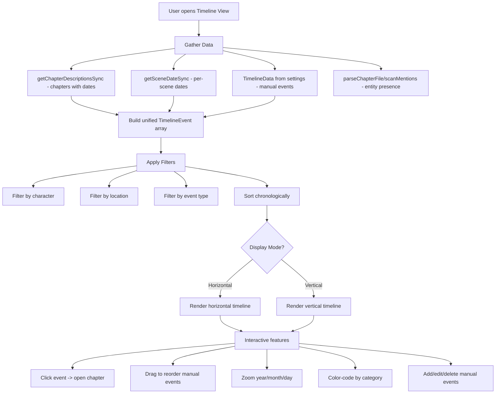
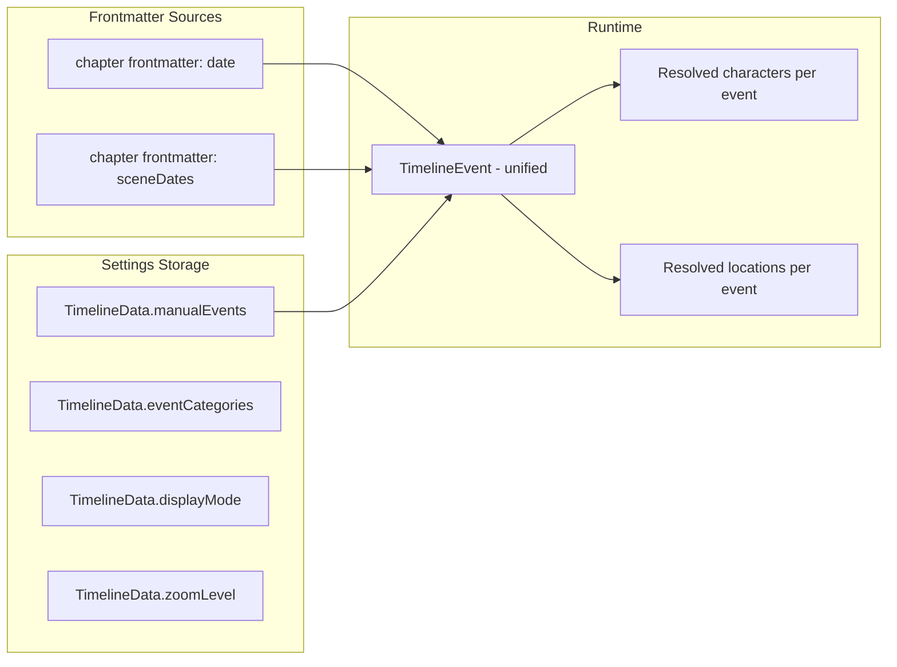
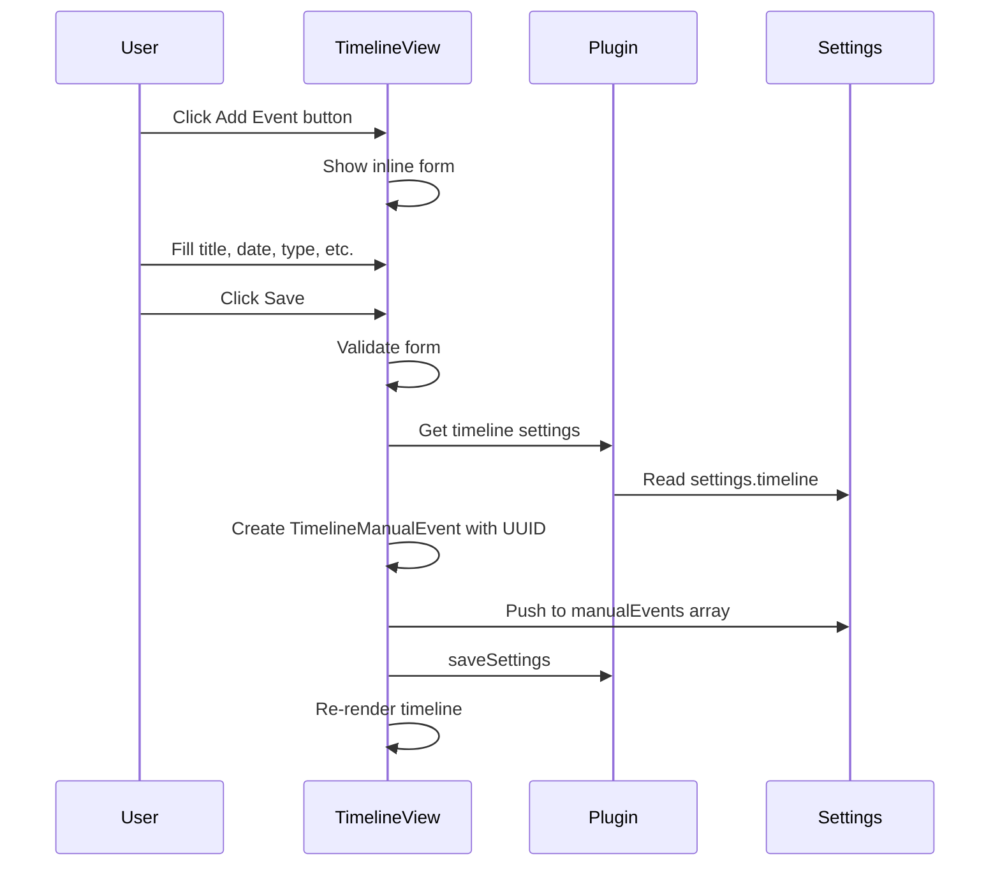
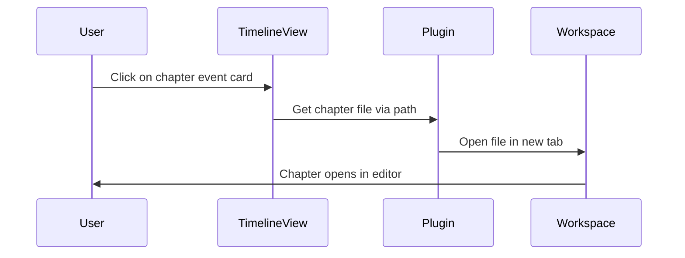

# Timeline View — Architecture Plan

## Overview

A new **Timeline** view that displays narrative events chronologically. Supports both **horizontal** and **vertical** display modes, integrates with the existing chapter/scene date infrastructure, and allows **manual event creation** for story events not tied to specific chapters.

Events come from three sources:
1. **Chapter dates** — from existing `date` frontmatter field
2. **Scene dates** — from existing `sceneDates` frontmatter map
3. **Manual events** — custom events stored per-project in `TimelineData` (similar to `PlotBoardData`)

Filtering is powered by the existing [`scanMentions()`](src/main.ts:3098) method for detecting character/location presence in chapters.

---

## Architecture Diagram



---

## Data Model



---

## Files to Create / Modify

### New Files

| File | Purpose |
|------|---------|
| [`src/views/TimelineView.ts`](src/views/TimelineView.ts) | Main Timeline view class extending `ItemView` — rendering, interaction, filters |
| [`src/utils/timelineUtils.ts`](src/utils/timelineUtils.ts) | Data gathering, event building, date parsing/sorting utilities |

### Modified Files

| File | Changes |
|------|---------|
| [`src/types/index.ts`](src/types/index.ts) | Add `TimelineEvent`, `TimelineCategory`, `TimelineData`, `TimelineViewMode`, `TimelineZoomLevel` interfaces |
| [`src/main.ts`](src/main.ts) | Import + `registerView` + `activateTimelineView()` + command |
| [`src/utils/toolbarUtils.ts`](src/utils/toolbarUtils.ts) | Add Timeline button to the Views panel |
| [`src/i18n/en.ts`](src/i18n/en.ts) | Add English translation keys for timeline UI |
| [`src/i18n/de.ts`](src/i18n/de.ts) | Add German translation keys for timeline UI |
| [`src/settings/NovalistSettings.ts`](src/settings/NovalistSettings.ts) | Add `TimelineData` to `DEFAULT_SETTINGS` and `ProjectData` |
| [`styles.css`](styles.css) | Add CSS for timeline layout, events, filters, zoom controls |

---

## Type Definitions

New types to add to [`src/types/index.ts`](src/types/index.ts):

```typescript
// ─── Timeline ───────────────────────────────────────────────────────

export type TimelineViewMode = 'horizontal' | 'vertical';
export type TimelineZoomLevel = 'year' | 'month' | 'day';
export type TimelineEventSource = 'chapter' | 'scene' | 'manual';
export type TimelineEventType = 'plot-point' | 'character-event' | 'world-event' | 'custom';

export interface TimelineCategory {
  id: string;
  name: string;
  color: string;
}

export interface TimelineManualEvent {
  id: string;
  /** Display title for the event */
  title: string;
  /** Date string — YYYY-MM-DD or free-form */
  date: string;
  /** Optional description */
  description: string;
  /** Event type for filtering */
  eventType: TimelineEventType;
  /** Category ID for color-coding */
  categoryId: string;
  /** Optional link to a chapter file path */
  linkedChapterPath: string;
  /** Optional link to a scene name within the linked chapter */
  linkedSceneName: string;
  /** Manual sort order within same date */
  order: number;
}

export interface TimelineData {
  /** Manual events not derived from chapters */
  manualEvents: TimelineManualEvent[];
  /** User-defined categories for color-coding */
  categories: TimelineCategory[];
  /** Current display mode preference */
  viewMode: TimelineViewMode;
  /** Current zoom level preference */
  zoomLevel: TimelineZoomLevel;
}
```

Runtime-only type used in the view (not persisted):

```typescript
/** Unified event used for rendering — built at render time from all sources */
export interface TimelineEvent {
  id: string;
  title: string;
  date: string;
  /** Parsed sortable date — null if date cannot be parsed */
  sortDate: Date | null;
  description: string;
  source: TimelineEventSource;
  eventType: TimelineEventType;
  categoryId: string;
  categoryColor: string;
  /** Chapter file path if linked */
  chapterPath: string;
  /** Scene name within chapter if applicable */
  sceneName: string;
  /** Chapter order for items with same date */
  chapterOrder: number;
  /** Characters detected in the source chapter */
  characters: string[];
  /** Locations detected in the source chapter */
  locations: string[];
}
```

---

## Settings Integration

### ProjectData extension

Add `timeline` field to [`ProjectData`](src/types/index.ts:11):

```typescript
export interface ProjectData {
  commentThreads: CommentThread[];
  plotBoard: PlotBoardData;
  wordCountGoals: WordCountGoals;
  explorerGroupCollapsed: Record<string, boolean>;
  relationshipPairs: Record<string, string[]>;
  recentEdits: RecentEditEntry[];
  timeline: TimelineData;  // NEW
}
```

### NovalistSettings extension

Add `timeline` to the top-level [`NovalistSettings`](src/types/index.ts:20) as well (following the same pattern as `plotBoard`):

```typescript
timeline: TimelineData;
```

### Default values

In [`createDefaultProjectData()`](src/settings/NovalistSettings.ts:223):

```typescript
timeline: {
  manualEvents: [],
  categories: [
    { id: 'plot', name: 'Plot Point', color: '#e74c3c' },
    { id: 'character', name: 'Character Event', color: '#3498db' },
    { id: 'world', name: 'World Event', color: '#2ecc71' },
  ],
  viewMode: 'vertical',
  zoomLevel: 'month',
}
```

---

## View Implementation: `TimelineView`

### Class structure

```
TimelineView extends ItemView
├── getViewType() → 'novalist-timeline'
├── getDisplayText() → t('timeline.displayName')
├── getIcon() → 'calendar-range'
├── onOpen() → render() + registerVaultEvents()
├── onClose() → cleanup
│
├── State
│   ├── currentMode: TimelineViewMode
│   ├── currentZoom: TimelineZoomLevel
│   ├── filterCharacter: string | null
│   ├── filterLocation: string | null
│   ├── filterEventType: TimelineEventType | null
│   ├── events: TimelineEvent[]       (computed at render)
│   ├── entityCache: Map             (chapter → entities)
│   
├── Rendering
│   ├── render() → master orchestrator
│   ├── renderToolbar() → mode toggle, zoom, filters, add-event button
│   ├── renderHorizontalTimeline()
│   ├── renderVerticalTimeline()
│   ├── renderEventCard()
│   ├── renderFilterDropdowns()
│   ├── renderZoomControls()
│   
├── Data
│   ├── buildEvents() → gather + merge all sources
│   ├── applyFilters() → filter by character/location/type
│   ├── sortEvents() → chronological sort
│   
├── Interactions
│   ├── onEventClick() → open chapter/scene
│   ├── onAddManualEvent() → open inline form
│   ├── onEditEvent() → edit manual event
│   ├── onDeleteEvent() → remove manual event
│   ├── onDragStart/onDragEnd() → reorder manual events
│   ├── onZoomChange() → update zoom level
│   └── onModeToggle() → switch horizontal/vertical
```

---

## Utility Module: `timelineUtils.ts`

Key functions:

### `buildTimelineEvents(plugin): Promise<TimelineEvent[]>`
1. Call `plugin.getChapterDescriptionsSync()` to get all chapters with dates
2. For each chapter with a date, create a `TimelineEvent` with `source: 'chapter'`
3. For each chapter, iterate `sceneDates` via `plugin.getSceneDateSync()` → create `source: 'scene'` events
4. Load manual events from `plugin.settings.timeline.manualEvents` → create `source: 'manual'` events
5. For chapter/scene events, call `plugin.parseChapterFile()` to get character/location mentions (cached)
6. Return merged array

### `parseTimelineDate(dateStr: string): Date | null`
Parse common date formats:
- `YYYY-MM-DD` (ISO)
- `YYYY-MM` (month precision)
- `YYYY` (year precision)
- `Month DD, YYYY` (e.g., "January 15, 2024")
- `DD.MM.YYYY` (European format)
- Return `null` for unrecognizable formats — these events still display but sort at the end

### `sortTimelineEvents(events: TimelineEvent[]): TimelineEvent[]`
Sort by `sortDate`, then by `chapterOrder` for same-date items, then by manual `order`.

### `getUniqueCharacters(events: TimelineEvent[]): string[]`
Extract all unique character names across all events for the filter dropdown.

### `getUniqueLocations(events: TimelineEvent[]): string[]`
Extract all unique location names across all events for the filter dropdown.

---

## UI Layout

### Toolbar Bar (always visible at top)

```
┌──────────────────────────────────────────────────────────────────┐
│ [📊 Vertical ▾] [🔍 Zoom: Month ▾] [👤 Filter ▾] [📍 Filter ▾]│
│ [🏷️ Type ▾]                                          [＋ Add]  │
└──────────────────────────────────────────────────────────────────┘
```

### Vertical Mode (default — best for most cases)

```
┌──────────────────────────────────────────────────────────────────┐
│                          2024                                     │
│  ─────────────────────────────────────────────────────────────── │
│                                                                   │
│  ● Jan 15  ┌──────────────────────────────┐                      │
│     ───────│ Chapter 1: The Beginning     │ [🟢 Plot]            │
│            │ Characters: Amy, Bob          │                      │
│            │ Locations: Castle             │                      │
│            └──────────────────────────────┘                      │
│                                                                   │
│  ● Feb 3   ┌──────────────────────────────┐                      │
│     ───────│ ⭐ War declared              │ [🔴 World]           │
│            │ Manual event                  │                      │
│            └──────────────────────────────┘                      │
│                                                                   │
│  ● Feb 10  ┌──────────────────────────────┐                      │
│     ───────│ Chapter 2: The Journey       │ [🟢 Plot]            │
│            │  └ Scene: Morning Departure  │                      │
│            │ Characters: Amy              │                      │
│            └──────────────────────────────┘                      │
│                                                                   │
│  ● ???     ┌──────────────────────────────┐                      │
│     ───────│ Chapter 5: The Unknown       │ [⚪ No date]         │
│            └──────────────────────────────┘                      │
└──────────────────────────────────────────────────────────────────┘
```

### Horizontal Mode

```
┌──────────────────────────────────────────────────────────────────────┐
│  ◄  ───●─────────●─────────●─────────●─────────●───────────────  ►  │
│       Jan       Feb       Mar       Apr       May                    │
│        │         │                    │                               │
│   ┌────┴───┐ ┌───┴────┐         ┌────┴───┐                          │
│   │Ch 1    │ │War     │         │Ch 2    │                           │
│   │The     │ │declared│         │Journey │                           │
│   │Begin.. │ │        │         │        │                           │
│   └────────┘ └────────┘         └────────┘                           │
└──────────────────────────────────────────────────────────────────────┘
```

---

## Zoom Levels

| Level | Grouping | Shows |
|-------|----------|-------|
| **Year** | Events grouped by year | Year headers, collapsed months |
| **Month** | Events grouped by month within year | Year + month headers, individual events |
| **Day** | Every event at day precision | Full date labels, individual event cards |

---

## Manual Event Form (inline)

When clicking "Add Event", an inline form appears at the top of the timeline:

```
┌──────────────────────────────────────────────────────────────────┐
│ Title: [________________________]                                 │
│ Date:  [____-__-__] (date picker)                                │
│ Type:  [Plot Point ▾]                                            │
│ Category: [Plot Point ▾]                                         │
│ Description: [________________________]                           │
│ Link to chapter: [None ▾]                                        │
│ Link to scene:   [None ▾]                                        │
│                                       [Cancel] [Save]            │
└──────────────────────────────────────────────────────────────────┘
```

---

## Integration Points

### main.ts additions

1. **Import** `TimelineView` and `TIMELINE_VIEW_TYPE`
2. **Register view**: `this.registerView(TIMELINE_VIEW_TYPE, (leaf) => new TimelineView(leaf, this))`
3. **Add command**: `open-timeline` → `activateTimelineView()`
4. **Add method**: `activateTimelineView()` — follows exact same pattern as [`activateDashboardView()`](src/main.ts:3862)

### toolbarUtils.ts additions

Add Timeline button to the Views panel, after the Dashboard button:

```typescript
this.createRibbonButton(viewsItems, 'calendar-range', t('toolbar.timeline'), t('toolbar.timeline'), () => {
  void this.plugin.activateTimelineView();
});
```

---

## i18n Keys

### English (`en.ts`)

```
'cmd.openTimeline': 'Open timeline view'
'toolbar.timeline': 'Timeline'
'timeline.displayName': 'Timeline'
'timeline.addEvent': 'Add Event'
'timeline.editEvent': 'Edit Event'
'timeline.deleteEvent': 'Delete Event'
'timeline.deleteConfirm': 'Delete this event?'
'timeline.viewHorizontal': 'Horizontal'
'timeline.viewVertical': 'Vertical'
'timeline.zoomYear': 'Year'
'timeline.zoomMonth': 'Month'
'timeline.zoomDay': 'Day'
'timeline.filterCharacter': 'Filter by character'
'timeline.filterLocation': 'Filter by location'
'timeline.filterType': 'Filter by type'
'timeline.filterAll': 'All'
'timeline.eventTitle': 'Title'
'timeline.eventDate': 'Date'
'timeline.eventDescription': 'Description'
'timeline.eventType': 'Event Type'
'timeline.eventCategory': 'Category'
'timeline.linkChapter': 'Link to chapter'
'timeline.linkScene': 'Link to scene'
'timeline.noDate': 'No date'
'timeline.noEvents': 'No events to display. Add dates to your chapters or create manual events.'
'timeline.typePlotPoint': 'Plot Point'
'timeline.typeCharacterEvent': 'Character Event'
'timeline.typeWorldEvent': 'World Event'
'timeline.typeCustom': 'Custom'
'timeline.chapterEvent': 'Chapter'
'timeline.sceneEvent': 'Scene'
'timeline.manualEvent': 'Manual'
'timeline.characters': 'Characters'
'timeline.locations': 'Locations'
'timeline.save': 'Save'
'timeline.cancel': 'Cancel'
'timeline.categoryManage': 'Manage Categories'
'timeline.categoryName': 'Category Name'
'timeline.categoryColor': 'Color'
'timeline.noChapterLink': 'None'
```

### German (`de.ts`)

Equivalent translations in German for all keys above.

---

## CSS Structure

All classes prefixed with `novalist-timeline-` to avoid conflicts:

```
.novalist-timeline              — root container
.novalist-timeline-toolbar      — top toolbar bar
.novalist-timeline-toolbar-group — grouped controls
.novalist-timeline-mode-toggle  — horizontal/vertical switch
.novalist-timeline-zoom         — zoom level selector
.novalist-timeline-filter       — filter dropdown
.novalist-timeline-add-btn      — add event button

.novalist-timeline-content      — scrollable timeline area
.novalist-timeline-vertical     — vertical mode layout
.novalist-timeline-horizontal   — horizontal mode layout

.novalist-timeline-axis         — the timeline line/axis
.novalist-timeline-year-header  — year grouping header
.novalist-timeline-month-header — month grouping header

.novalist-timeline-event        — individual event card
.novalist-timeline-event-dot    — dot on the axis
.novalist-timeline-event-card   — card body
.novalist-timeline-event-title  — event title
.novalist-timeline-event-date   — date label
.novalist-timeline-event-meta   — characters/locations badges
.novalist-timeline-event-badge  — entity badge pill
.novalist-timeline-event-type   — type indicator
.novalist-timeline-event-source — chapter/scene/manual indicator
.novalist-timeline-event.is-chapter   — chapter event styling
.novalist-timeline-event.is-scene     — scene event styling
.novalist-timeline-event.is-manual    — manual event styling
.novalist-timeline-event.is-no-date   — no-date events at end

.novalist-timeline-form         — inline add/edit form
.novalist-timeline-form-row     — form row
.novalist-timeline-form-actions — save/cancel buttons

.novalist-timeline-empty        — empty state message
.novalist-timeline-category-dot — color dot for categories

.novalist-timeline-drag-ghost   — drag handle visual
```

---

## Event Flow: Adding a Manual Event



---

## Event Flow: Navigating to Chapter



---

## Entity Caching Strategy

Since calling [`parseChapterFile()`](src/main.ts:3084) for every chapter on every render would be expensive, the view maintains a cache:

```typescript
private entityCache: Map<string, { characters: string[]; locations: string[] }> = new Map();
```

- Cache is populated lazily during [`buildEvents()`](src/utils/timelineUtils.ts)
- Cache is invalidated on vault `modify` events for chapter files
- Cache key is the chapter file path

---

## Implementation Order (Todo List)

The implementation should follow this sequence:

1. **Add types** to `src/types/index.ts` — `TimelineData`, `TimelineManualEvent`, `TimelineCategory`, `TimelineEvent`, etc.
2. **Update settings** — Add `timeline` to `ProjectData`, `NovalistSettings`, and `DEFAULT_SETTINGS` / `createDefaultProjectData()`
3. **Create `timelineUtils.ts`** — `buildTimelineEvents()`, `parseTimelineDate()`, `sortTimelineEvents()`, utility helpers
4. **Create `TimelineView.ts`** — View class with toolbar, vertical/horizontal rendering, event cards
5. **Register view in `main.ts`** — Import, registerView, activateTimelineView(), add command
6. **Add toolbar button** in `toolbarUtils.ts` — Timeline button in Views panel
7. **Add i18n keys** — English and German translations
8. **Add CSS styles** in `styles.css` — Complete timeline styling for both modes
9. **Implement filters** — Character, location, and event type filter dropdowns
10. **Implement manual event CRUD** — Inline form for adding/editing/deleting manual events
11. **Implement drag reorder** — Drag-to-reorder for manual events within same date
12. **Implement zoom levels** — Year/month/day zoom with grouping headers
13. **Test and polish** — Cross-mode testing, responsive behavior, edge cases
